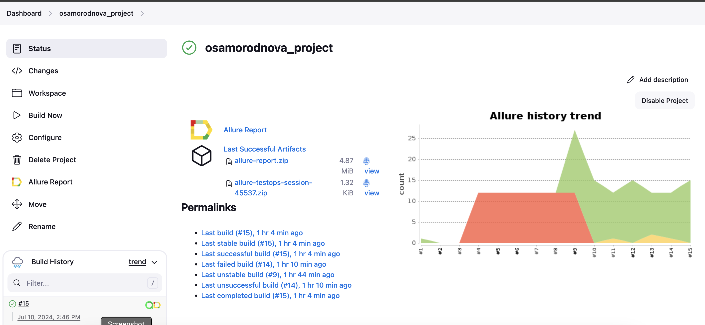
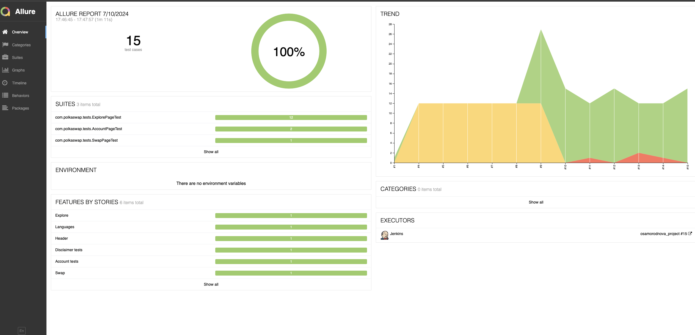
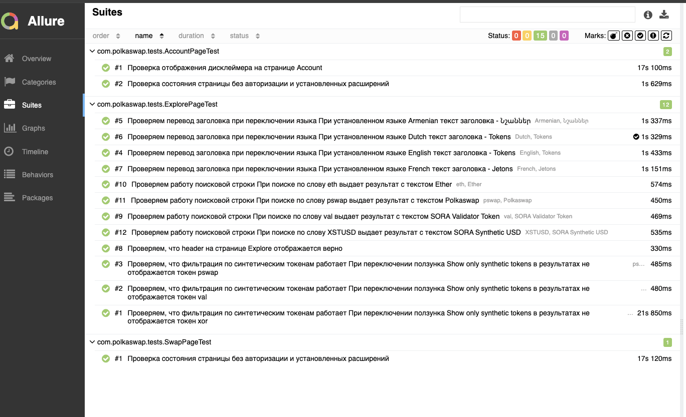
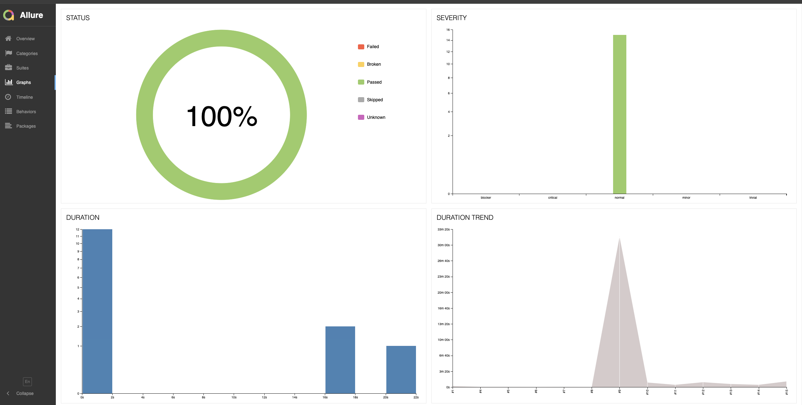
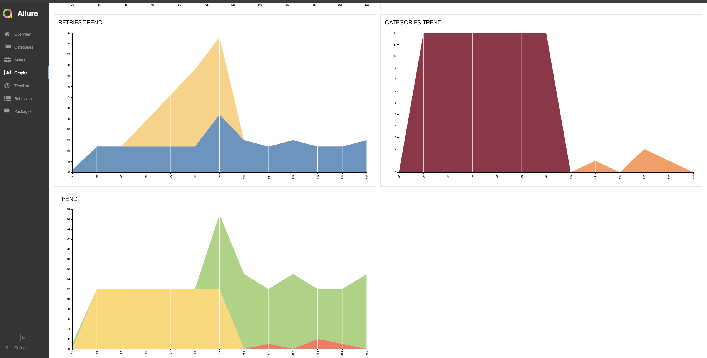
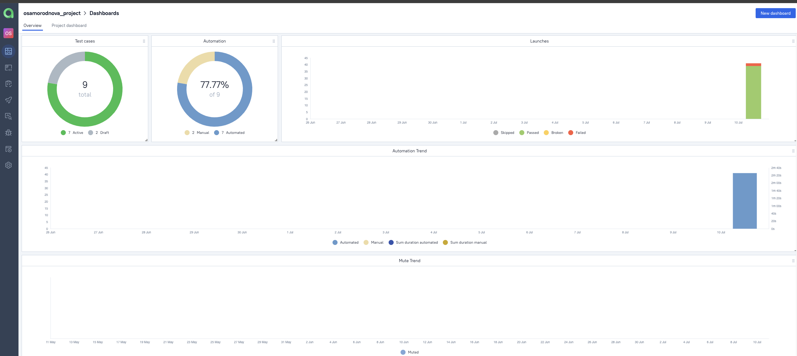
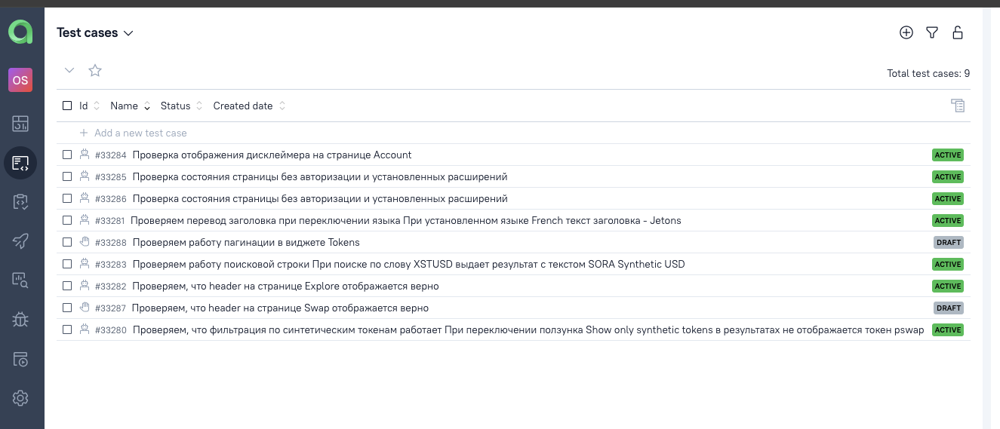
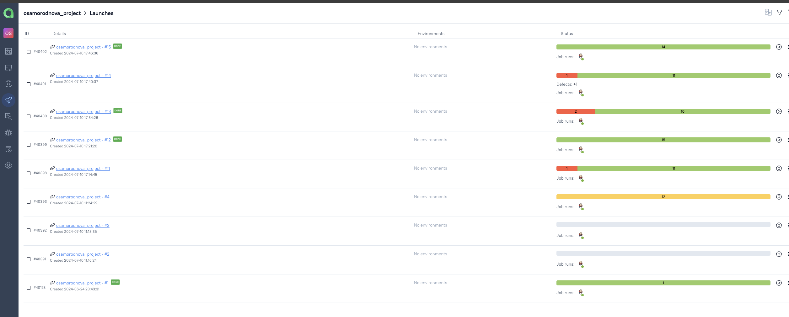
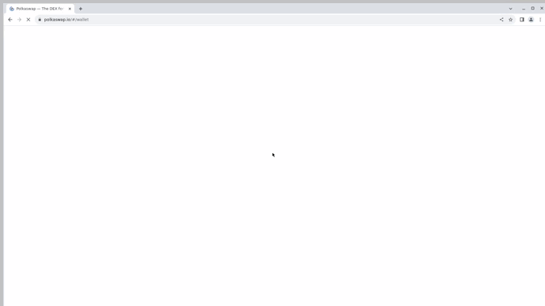

# <p align="center"></a> Проект по автоматизации тестирования сайта [Polkaswap.io](https://polkaswap.io/#/swap)  </p>

> <p align="center"> Polkaswap — децентрализованная биржа, ориентированная на взаимодействие разных блокчейнов и интеграцию с Polkadot. Это не кастодиальная биржа на базе автоматизированного маркетмейкинга (AMM), созданная специально для экосистемы Polkadot и будущего интероперабельности. </p>


## **Содержание:**
____

* <a href="#tools">Стек</a>

* <a href="#jenkins">Сборка в Jenkins</a>

* <a href="#console">Запуск из терминала</a>

* <a href="#allure">Allure отчет</a>

* <a href="#allure-testops">Интеграция с Allure TestOps</a>

* <a href="#video">Видео выполнения теста</a>
____
<a id="tools"></a>
## <a name="Используемый стек">**Используемый стек:**</a>

<p align="center">
<a href="https://www.jetbrains.com/idea/"></a>
<a href="https://www.java.com/ru/"></a>
<a href="https://ru.selenide.org/"></a>
<a href="https://github.com/allure-framework"></a>
<a href="https://qameta.io/"></a>
<a href="https://github.com/gradle"></a>
<a href="https://github.com/junit-team/junit5"></a>
<a href="[https://github.com/junit-team/junit5](https://github.com/)"></a>
<a href="https://www.jenkins.io/"></a>
</p>

Код написан в <a href="https://www.jetbrains.com/idea/">IntelliJ IDEA</a>
Язык для написания тестов: <a href="https://www.java.com/ru/">Java</a>
Библиотека для написания UI тестов: <a href="https://ru.selenide.org/">Selenide</a>
Фреймворк для модульного тестирования: <a href="https://github.com/junit-team/junit5">Junit5</a>
Инструмент для автоматизации сборки: <a href="https://github.com/gradle">Gradle</a>
Фреймворк для удаленного запуска с тестовыми параметрами: <a href="https://www.jenkins.io/">Jenkins</a>
Отчеты о пройденных тестах формируются при помощи: <a href="https://github.com/allure-framework">Allure</a>
Реализована интеграция с <a href="https://qameta.io/">Allure TestOps</a>


<a id="jenkins"></a>
## </a><a name="Сборка"></a>Сборка в [Jenkins](https://jenkins.autotests.cloud/job/osamorodnova_project/)</a>

<p align="center">  
<a href="https://jenkins.autotests.cloud/job/osamorodnova_project/"></a>  
</p>

<a id="console"></a>
## Команды для запуска из терминала

***Локальный запуск:***
```bash  
gradle clean polkaswapTests
```

***TODO!!!Удалённый запуск через Jenkins:***
Код пока не актуален!
```bash  
clean polkaswapTests
"-Dbrowser=${browser}"
"-DbrowserVersion=${browserVersion}"
"-DbrowserSize=${browserSize}"
"-DbaseUrl=${baseUrl}"
"-DremoteUrl=${remoteUrl}"
```
<a id="allure"></a>
## </a> <a name="Allure"></a>Allure [отчет](https://jenkins.autotests.cloud/job/osamorodnova_project/allure/)</a>


### *Основная страница отчёта*

<p align="center">  
  
</p>  

### *Тест-кейсы*

<p align="center">  
  
</p>

### *Графики*

  <p align="center">  


  
</p>


<a id="allure-testops"></a>
## </a>Интеграция с <a target="_blank" href="https://allure.autotests.cloud/project/4307/dashboards">Allure TestOps</a>

### *Allure TestOps Dashboard*

<p align="center">  
  
</p>  

### *Тест-кейсы*

<p align="center">  
  
</p>

### *Запуски*

<p align="center">  
  
</p>


<a id="video"></a>
## Видео выполнения теста

<p align="center">
   
</p>
